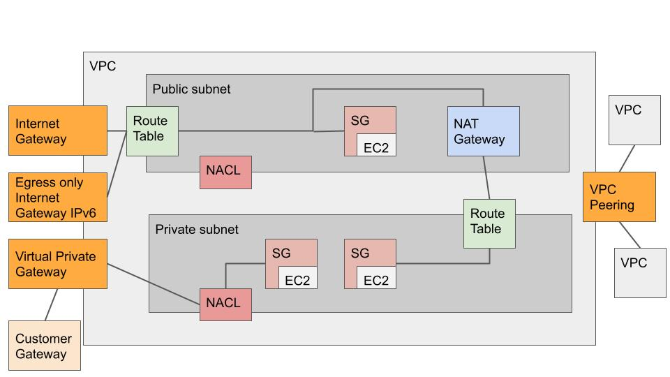
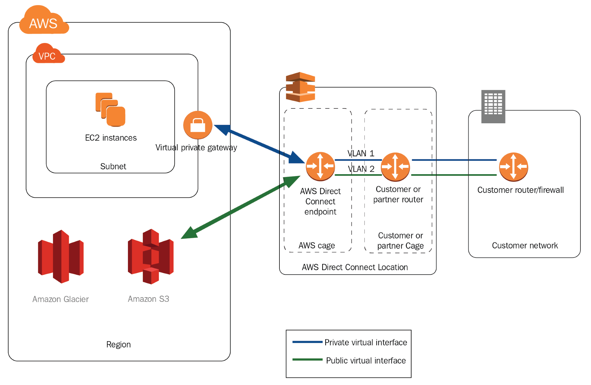

# Networking
#### Contents
- [Amazon VPC](https://github.com/alxojy/AWS-SAA-C02/blob/main/networking/ReadME.md#amazon-vpc-faq)
- [AWS Transit Gateway](https://github.com/alxojy/AWS-SAA-C02/blob/main/networking/ReadME.md#aws-transit-gateway-faq)
- [AWS Direct Connect](https://github.com/alxojy/AWS-SAA-C02/blob/main/networking/ReadME.md#aws-direct-connect-faq)

## [Amazon VPC FAQ](https://aws.amazon.com/vpc/faqs/)
#### What is Amazon VPC?
- Provision a logically isolated section of AWS cloud where AWS resources can be launched in the virtual network defined
- Have complete control over virtual networking environment including selection of IP address ranges, creation of subnets, configuration of route tables & network gateways
- Create a hardware VPN connection between on-premises & VPC
- Customizable network configuration with public & private subnets
- Multiple layers of security including security groups & NACLs

#### VPC components
- Internet Gateway
- NAT Gateway: Managed NAT service for resources in a private subnet to access the Internet
- Virtual Private Gateway: VPC side of a VPN connection that connects to the Customer Gateway
- VPC Endpoints: Enables private connectivity to services hosted in AWS from within the VPC without an Internet Gateway, VPN, NAT or firewall proxies
- Peering connection
- Egress-only Internet Gateway: For IPv6 traffic

||
|----|
|Example VPC|

#### VPC endpoints
Gateway | Interface 
----|----
Only for AWS services ie. S3 & DynamoDB | Private connectivity to services powered by PrivateLink ie. AWS services, own services or SaaS
Add an entry to the route table & route traffic to the supported service via AWS private network | Supports connectivity over Direct Connect

### Connectivity
#### Connectivity options
- Internet gateway
- Corporate data center via AWS site to site VPN connection (Virtual Private Gateway)
- Both the Internet & Virtual Private Gateway
- Other AWS services (Internet gateway, NAT, Virtual Private Gateway, VPC endpoints)
- VPC peering

#### How do instances in a VPC access the Internet?
For instances with public IPs
- Public IP address & EIPs to send and receive traffic from the Internet   

For instances without public IPs
- NAT gateways. These instances use the public IP of the NAT gateway
- VPN or Direct Connect connection. These instances can route their Internet traffic down the virtual private gateway to the existing data center

#### How does AWS site to site VPN connection work with VPC?
AWS site to site VPN connection connects the VPC to the datacenter. Amazon supports IPSec VPN connections whereby data transferred between the VPC & datacenter routes over an encrypted VPN connection

### IP addressing
#### What IP address ranges can be used in the VPC?
- Any IPv4 address range
- Publicly routable IP blocks are only reachable via the virtual private gateway & cannot be accessed via the Internet
- Can bring own public IPv4 addresses into the VPC & allocate them to subnets & EC2 instances. To access these addresses over the Internet, the addresses have to be advertised to the Internet from on-premises network. The traffic then has to be routed to the VPC from the on-premises network via AWS Direct Connect or VPN
- Amazon reserves 5 IP addresses for networking purposes

#### How to assign private IP addresses to EC2 instances within a VPC?
When launching a new EC2 instance within a VPC, the primary private IP address can be optionally specified. If it is not specified, AWS automatically assigns a secondary private IP address range that is assigned to the subnet. The primary private IP addresses are retained for the instance's lifetime but the secondary private IP addresses can be assigned, unassigned or moved between instances

#### Can multiple IP addresses be assigned to an instance?
Yes. One or more secondary private IP addresses can be assigned to an ENI or EC2 instance

#### Can one or more EIP addresses be assigned to an EC2 instance?
Yes. However, the EIPs will only be reachable from the Internet (not over the VPN connection). Each EIP address must be associated with a unique private IP address on the instance. EIP addresses should only be used on instances in subnets configured to route their traffic directly to the Internet Gateway. EIPs cannot be used on instances in subnets configured to use a NAT gateway to access the Internet

### Security
#### How to secure EC2 instances running within the VPC?
- Security groups can be used to secure instances within a VPC. It enables both inbound & outbound traffic to be specified
- NACLs can allow or deny traffic on the subnet level

#### Security groups vs NACLs
Security group | NACL
----|----
Instance level | Subnet level
Only deny rules | Both allow & deny rules
Stateful - Tracks the origin of a request & automatically allow the reply to the request to be returned | Stateless - Outbound rule must explicitly allow the destination & port for the reply

#### Default security group
- Allow inbound traffic from network interfaces that are assigned to the same security group
- Allow all outbound traffic

#### Default vs custom NACL
Default | Custom
----|----
Allow all inbound & outbound traffic | By default, deny all inbound & outbound traffic

#### Can EC2 instances within a VPC communicate with EC2 instances in another region?
Yes via
- Inter-Region VPC peering
- Public IP addresses
- NAT gateway
- VPN connection
- Direct Connect connection

#### What is Amazon VPC flow logs?
- Capture information about the IP traffic going to & from network interfaces in the VPC
- Can be published to CloudWatch logs or S3
- Allow monitoring to detect anomalies & prevent data leakage or troubleshoot network connectivity & configuration issues
- Gain insights about who initiated TCP connections and actual packet-level source & destination for traffic flowing through intermediate layers ie. NAT Gateway
- Can be created for a VPC, subnet or network interface
- Choose metadata fields to be captured; maximum aggregatio ninterval & preferred log destination

### VPC & EC2
#### Can a VPC span AZs?
Yes

#### Can a subnet span AZs?
No

#### Can an EC2 instance boot from an EBS volume within a VPC?
Yes however an instance launched in a VPC using EBS backed AMI maintains the same IP address when stopped & restarted

#### Can EC2 RIs be used in a VPC?
Yes

### VPC peering
#### Can a peering connection be created for a VPC in a different region?
Yes

#### Can a peering connection be created for a VPC in another AWS account?
Yes

### AWS PrivateLink
#### What is AWS PrivateLink?
- Enables customers to access services hosted on AWS while keeping all the network traffic within the AWS network
- Service users can use this to privately access services powered by PrivateLink from Amazon VPC or on-premises without using public IPs & without requiring the traffic to traverse across the Internet
- Service owners can register NLBs to PrivateLink services & provide the services to other AWS customers

#### How to use AWS PrivateLink?
- As a service user, 
  - VPC interface endpoints must be created for services powered by PrivateLink
  - The service endpoints will appear as ENIs with private IPs in VPCs
  - Once the endpoints are created, any traffic destined to these IPs will get privately routed to the corresponding AWS services
- As a service owner, 
  - Onboard services to AWS PrivateLink by establishing a NLB to front the service & create a PrivateLink service to register with the NLB
  - Customers will be able to establish endpoints within their VPC to connect to the service after their accounts & IAM roles are whitelisted

#### Which services are available on AWS PrivateLink?
- EC2
- ELB
- Kinesis Streams
- EC2 Systems Manager
- SNS
- DataSync

## [AWS Transit Gateway FAQ](https://aws.amazon.com/transit-gateway/faqs/)
#### What is AWS Transit Gateway?
Connects VPCs & on-premises networks through a central hub to simplify the network from complex peering relationships

#### How does routing work in AWS Transit Gateway?
- Supports dynamic & static routing between attached Amazon VPCs and VPNs
- Amazon VPCs, VPNs, Direct Connect gateways, Transite Gateway Connect and peered Transit Gateways are associated to the default route table

#### How are routes propagated into AWS Transit Gateway?
- Routes propagated to/from on-premises networks
  - When connect VPN or Direct Connect Gateway, routes are propagated between AWS Transit Gateway and on-premises router using Border Gateway Protocol
- Routes propagated to/from Amazon VPCs
  - When an Amazon VPC is attached to an AWS Transit Gateway, the Amazon VPC Classless Inter-Domain Routing CIDR will propagate into the AWS Transit Gateway route table using internal IPs
  - CIDR is a method for allocating IP addresses and IP routing to slow the growth of ruoting tables on routers across the Internet
  - Routes in the AWS Transit Gateway route table will not be propagated to the Amazon VPC's route table

## [AWS Direct Connect FAQ](https://aws.amazon.com/directconnect/faqs/)
#### What is AWS Direct Connect?
- Data is transported through a private network connection between on-premises & AWS
- Services ie. EC2, VPC, S3 & DynamoDB can be used with Direct Connect

